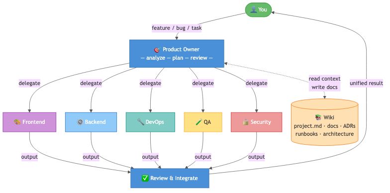
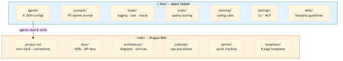

# Kiro Factory Template

A multi-agent AI software team for [Kiro CLI](https://github.com/amazon/kiro-cli). A **Product Owner** orchestrator delegates to **Frontend**, **Backend**, **DevOps**, **QA**, and **Security** agents — all sharing a project wiki as memory.

> Looking for a provider-agnostic version? See [ai-factory-template](https://github.com/fonthap/ai-factory-template) — same concept, works with any AI tool.

## Concept

**The problem:** AI coding assistants are stateless. They forget context between sessions, don't follow your team's conventions, and can't coordinate multi-role work.

**The solution:** A team of specialized AI agents that share a persistent wiki. Each agent has deep expertise in one domain. A Product Owner orchestrates them — breaking tasks into sub-tasks, delegating in parallel, reviewing quality, and keeping the wiki updated.

### How It Works



1. **You** describe a feature, bug, or task
2. **Product Owner** reads the wiki for context (tech stack, conventions, past decisions)
3. **PO plans** which agents to dispatch — in parallel when possible
4. **Agents** write code, tests, infra, docs — each in their specialty
5. **PO reviews** quality, integrates the pieces, resolves conflicts
6. **Wiki updates** — knowledge compounds over time

### File Structure



## Agent Team

| Agent | Role | Expertise |
|-------|------|-----------|
| `kiro-factory` | **Product Owner** | Task breakdown, parallel delegation (DAG), code review, integration |
| `factory-frontend` | Senior Frontend | React/Next.js, TypeScript, accessibility, component tests |
| `factory-backend` | Senior Backend | APIs, databases, auth, business logic, integration tests |
| `factory-devops` | Senior DevOps/SRE | CI/CD, Terraform, Kubernetes, monitoring, runbooks |
| `factory-qa` | Senior QA | Test strategy, E2E automation, performance testing, quality gates |
| `factory-security` | Senior Security | Threat modeling, OWASP, secure code review, dependency scanning |

## Key Features

| Feature | Description |
|---------|-------------|
| **Parallel DAG** | Independent agents run simultaneously |
| **Plan-and-Execute** | Complex tasks get: plan → execute → review → revise |
| **Code Review** | PO scores each agent's output (5 criteria per role) |
| **Reflection** | Agents self-check before responding |
| **Output Validation** | Mandatory sections enforced per domain |
| **Wiki Memory** | Agents read past ADRs, runbooks, and patterns |
| **Cost Tracking** | Model-aware pricing with multi-day reports |
| **Trace Viewer** | OTel-style trace_id per request for debugging |
| **Karpathy Skill** | LLM coding best practices loaded globally |

## Quick Start

```bash
# 1. Install Kiro CLI
npm install -g @anthropic/kiro-cli

# 2. Clone and setup
git clone https://github.com/fonthap/kiro-factory-template.git
cd kiro-factory-template
bash setup.sh

# 3. Start
kiro-cli chat
```

`setup.sh` asks for your project name and GitHub username, replaces all placeholders, and installs everything to `~/.kiro/` and `~/wiki/`.

### Example Prompts

```
"build a login page with email/password form"
"add a REST API for user CRUD with PostgreSQL"
"set up GitHub Actions CI with lint, test, build, deploy"
"write E2E tests for the checkout flow"
"review this code for security vulnerabilities"
"create an ADR for choosing PostgreSQL over MongoDB"
```

## What's Inside

```
.kiro/
├── agents/          6 agent configs (PO + 5 engineers)
├── prompts/         PO system prompt (plan-and-execute)
├── evals/           Quality scoring criteria per agent
├── hooks/           Logging, cost tracking, trace viewer
├── steering/        Global coding standards
├── settings/        CLI config + MCP (Playwright for web browsing)
├── skills/          Karpathy coding guidelines
└── docs/            Agent onboarding runbook

wiki/
├── KIRO.md          Wiki schema (how agents operate)
├── templates/       8 page templates (ADR, sprint, runbook, incident, etc.)
└── wiki/
    ├── project.md   Tech stack, conventions, environments
    ├── index.md     Master page index (agents read first)
    ├── log.md       Activity timeline
    ├── docs/        ADRs, API docs, guides
    ├── architecture/  System diagrams, service maps
    ├── runbooks/    Operational procedures
    ├── sprints/     Sprint tracking
    └── projects/    Sub-projects, features
```

## Customization

**Change model** — Edit `.kiro/settings/cli.json` or each agent's `model` field.

**Add/remove agents** — See [docs/agent-onboarding.md](.kiro/docs/agent-onboarding.md).

**Add MCP servers** — Edit `.kiro/settings/mcp.json` (Playwright pre-configured).

**Adjust rules** — Edit `.kiro/steering/factory-rules.md`.

## Tools

```bash
~/.kiro/hooks/factory-cost.sh          # cost report (today)
~/.kiro/hooks/factory-cost.sh 7d       # last 7 days
~/.kiro/hooks/factory-trace.sh         # last trace
~/.kiro/hooks/factory-trace.sh all     # all traces today
~/.kiro/hooks/factory-logs.sh summary  # log summary
```

## License

MIT
